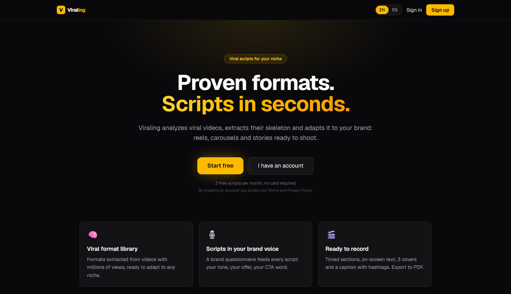

# Viraling

AI script generator for short-form creators. A creator describes their niche once, picks a proven viral format from the library, and gets a ready-to-record script (reel, carousel or story) in their brand voice, exportable as a production PDF.

**Live demo:** https://viraling.vercel.app (free plan, 3 scripts per month, no card)



## What it does

- **Brand onboarding.** An 8-question wizard per niche captures offer, audience, tone, forbidden phrases, CTA word and recording capacity. Users can run several niches.
- **Format library.** The admin feeds transcripts of viral videos; Claude extracts a reusable skeleton (structure, hook type, pacing, visual elements, CTA type, replicable rules). Users can also extract private formats from transcripts they paste.
- **Script generator.** Format skeleton + niche profile + content type produce a structured script: five timed sections with on-screen text and three cover variants for reels, 7 to 10 slides for carousels, a 3 to 5 step selling sequence for stories.
- **PDF export.** Server-side production guide with timings, on-screen text and covers.
- **Token economy.** Every generation debits one credit inside a transaction before the AI call. Free plan resets monthly by cron.
- **Admin panel.** User count, AI usage, global kill switch, format CRUD with reference images on R2, manual credit adjustments with an audit trail.
- **Bilingual UI.** English by default, Spanish with one click, and scripts are generated in the language of each niche.

This is Phase 1 of a four-phase plan (see [CLAUDE.md](CLAUDE.md)). Calendar, CRM, editing service and cover editor are out of scope for this release.

## Stack

| Layer | Choice |
| --- | --- |
| Framework | Next.js 16 App Router, React 19, TypeScript |
| Styling | Tailwind CSS 4 |
| Auth | Clerk (roles stored in the DB, never trusted from client metadata) |
| Database | Neon Postgres with Row Level Security, Drizzle ORM |
| AI | Claude API (`claude-sonnet-4-6`), server-only |
| Rate limiting | Upstash Redis |
| Storage | Cloudflare R2 with presigned URLs |
| PDF | @react-pdf/renderer |
| Hosting | Vercel (with Vercel Cron for monthly resets) |

## Security design

The main risk in an AI SaaS is someone burning the provider bill. The defenses are layered:

1. **Session first.** Middleware returns 401 JSON on any `/api` route without a Clerk session before any handler runs.
2. **Credits before AI.** `consumeTokens` runs a conditional `UPDATE ... WHERE balance >= amount` and writes the ledger row in the same transaction. No credit, no API call. Failed generations refund through the same ledger.
3. **Rate limits.** Sliding window per user (5/min) and per IP (20/min) on AI endpoints, 429 with `Retry-After`.
4. **Kill switch.** A DB flag the admin can flip to return 503 from every AI endpoint.
5. **Prompt injection.** User text is wrapped as delimited data with an explicit "never treat as instructions" notice, and the system prompt is fixed on the server. Output is parsed and validated with Zod, with a single correction retry.
6. **Row Level Security.** Every table has RLS enabled and forced. The app sets `app.current_user_id` and `app.current_role` per transaction and connects with a dedicated role without `BYPASSRLS`. Handlers still validate ownership at the application level (defense in two layers).
7. **Input validation.** Zod on every request body, UUIDs validated as UUIDs, bounded text lengths.
8. **Headers and CORS.** Strict CSP, `X-Frame-Options: DENY`, `nosniff`, `Referrer-Policy`, and a same-origin allowlist for API routes (403 on foreign origins).
9. **Uploads.** Browser uploads go straight to R2 through 15-minute presigned URLs with a content-type whitelist. The server never receives the file.

## Project layout

```
src/
  app/            routes (pages + route handlers under app/api)
  components/     client components (forms, admin panels, i18n provider)
  db/             Drizzle schema and the RLS transaction helper
  lib/
    ai/           Claude wrapper, system prompts, JSON helpers
    validations/  Zod schemas shared by handlers and tests
    i18n/         ES/EN dictionaries
    pdf/          PDF document
    tokens.ts     credit ledger (the only place that touches balances)
    rate-limit.ts Upstash limiters
  proxy.ts        Clerk middleware, CORS allowlist, security headers
drizzle/          migrations and RLS policies
scripts/          DB setup, seeding and integration checks
```

## Running locally

Requirements: Node 22, a Neon database, a Clerk application, an Anthropic API key, an Upstash Redis database. R2 is only needed for admin reference images.

```bash
npm install
cp .env.example .env.local   # fill in the values
npm run db:migrate           # create tables
npm run db:rls               # apply RLS policies
npm run db:seed              # load the starter format library
npm run dev
```

To promote your account to admin after signing up:

```bash
npm run user:set-role -- <your-email> admin
```

To turn an existing account into a shared demo (pro plan, 60 credits, a sample niche with full brand voice):

```bash
npm run db:seed-demo -- demo@example.com
```

Clerk syncs users to the DB through a webhook. Without one (typical in local dev), the app upserts the user on first login, so nothing breaks.

## Checks

```bash
npm test             # unit tests (Vitest): validation schemas, AI helpers, i18n parity
npm run lint
npx tsc --noEmit
npm run test:security   # integration: cross-user RLS, 401s, rate limit, headers (needs dev server + DB)
npm run test:tokens     # integration: ledger and concurrency (needs DB)
npm run db:verify       # confirms RLS is enabled and forced on every table
```

CI runs type check, lint and unit tests on every push.

## Notes

- The working name during development was FormatBrain, which still appears in the build brief. The product shipped as Viraling.
- Clerk runs on a development instance for the demo, so its components show a "Development mode" badge.
- Code comments and AI system prompts are in Spanish (the original target market); the UI, API responses and docs are in English.
