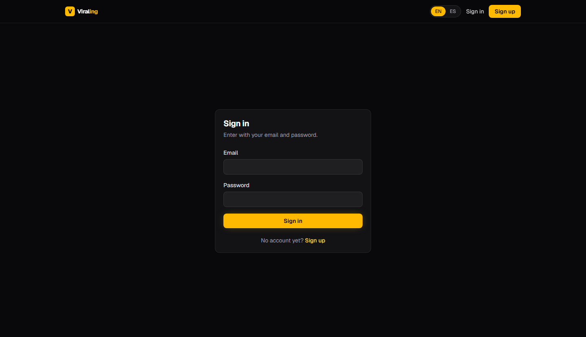

# Viraling

AI script generator for short-form creators. A creator describes their niche once, picks a proven viral format from the library, and gets a ready-to-record script (reel, carousel or story) in their brand voice, exportable as a production PDF.

**Live demo:** https://viraling.vercel.app

**No signup needed.** The landing and sign-in pages both carry an **Explore the demo** button that opens a session on a shared account already loaded with a niche, three generated scripts and 60 credits. Nothing to type.

If you would rather sign in by hand, the same account is `demo@viraling.app` / `ViralingDemo2026!`, or you can create a free one (3 scripts a month, no card).

Screens inside the app carry short notes explaining how the feature under them was built: the RLS scoping on the dashboard, the debit-then-call-then-refund sequence on the generator, the prompt injection handling on the extractor.




## What it does

- **Brand onboarding.** An 8-question wizard per niche captures offer, audience, tone, forbidden phrases, CTA word and recording capacity. Users can run several niches.
- **Format library.** The admin feeds transcripts of viral videos; Claude extracts a reusable skeleton (structure, hook type, pacing, visual elements, CTA type, replicable rules). Users can also extract private formats from transcripts they paste.
- **Script generator.** Format skeleton + niche profile + content type produce a structured script: five timed sections with on-screen text and three cover variants for reels, 7 to 10 slides for carousels, a 3 to 5 step selling sequence for stories.
- **PDF export.** Server-side production guide with timings, on-screen text and covers.
- **Token economy.** Every generation debits one credit inside a transaction before the AI call. Free plan resets monthly by cron.
- **Admin panel.** User count, AI usage, global kill switch, format CRUD with reference images on R2, manual credit adjustments with an audit trail.
- **Single source of copy.** Every user-facing string lives in one typed dictionary (`src/lib/i18n/dictionaries.ts`), so the UI reads from one place instead of scattered literals.

This is Phase 1 of a four-phase plan (see [CLAUDE.md](CLAUDE.md)). Calendar, CRM, editing service and cover editor are out of scope for this release.

## Stack

| Layer | Choice |
| --- | --- |
| Framework | Next.js 16 App Router, React 19, TypeScript |
| Styling | Tailwind CSS 4 |
| Auth | Own email + password auth: bcrypt hashes, DB-backed sessions in an httpOnly cookie |
| Database | Neon Postgres with Row Level Security, Drizzle ORM |
| AI | Claude API (`claude-sonnet-4-6`), server-only |
| Rate limiting | Upstash Redis with in-memory fallback |
| Storage | Cloudflare R2 with presigned URLs |
| PDF | @react-pdf/renderer |
| Hosting | Netlify (Next.js runtime; a scheduled function drives the monthly reset) |

## Security design

The main risk in an AI SaaS is someone burning the provider bill. The defenses are layered:

1. **Session first.** The proxy returns 401 JSON on any `/api` route without a session cookie, and every handler re-validates the session against the database before doing anything.
2. **Credits before AI.** `consumeTokens` runs a conditional `UPDATE ... WHERE balance >= amount` and writes the ledger row in the same transaction. No credit, no API call. Failed generations refund through the same ledger.
3. **Rate limits.** Sliding window per user (5/min) and per IP (20/min) on AI endpoints, plus per-IP sign-up and per-IP-and-email sign-in limits, 429 with `Retry-After`. Distributed through Upstash Redis, with an in-memory fallback so a Redis outage degrades protection instead of taking the app down.
4. **Kill switch.** A DB flag the admin can flip to return 503 from every AI endpoint.
5. **Prompt injection.** User text is wrapped as delimited data with an explicit "never treat as instructions" notice, and the system prompt is fixed on the server. Output is parsed and validated with Zod, with a single correction retry.
6. **Row Level Security.** Every table has RLS enabled and forced. The app sets `app.current_user_id` and `app.current_role` per transaction and connects with a dedicated role without `BYPASSRLS`. Handlers still validate ownership at the application level (defense in two layers).
7. **Input validation.** Zod on every request body, UUIDs validated as UUIDs, bounded text lengths.
8. **Headers and CORS.** Strict CSP, `X-Frame-Options: DENY`, `nosniff`, `Referrer-Policy`, and a same-origin allowlist for API routes (403 on foreign origins).
9. **Uploads.** Browser uploads go straight to R2 through 15-minute presigned URLs with a content-type whitelist. The server never receives the file.

## Project layout

```
src/
  app/            routes (pages + route handlers under app/api)
  components/     client components (forms, admin panels, i18n provider)
  db/             Drizzle schema and the RLS transaction helper
  lib/
    ai/           Claude wrapper, system prompts, JSON helpers
    auth/         password hashing, session tokens, cookie helpers
    validations/  Zod schemas shared by handlers and tests
    i18n/         ES/EN dictionaries
    pdf/          PDF document
    tokens.ts     credit ledger (the only place that touches balances)
    rate-limit.ts Upstash limiters with in-memory fallback
  proxy.ts        cookie gate, CORS allowlist, security headers
drizzle/          migrations and RLS policies
scripts/          DB setup, seeding and integration checks
```

## Running locally

Requirements: Node 22, a Neon database, an Anthropic API key. Upstash Redis is optional (without it, rate limits are per server instance). R2 is only needed for admin reference images.

```bash
npm install
cp .env.example .env.local   # fill in the values
npm run db:migrate           # create tables
npm run db:rls               # apply RLS policies
npm run db:seed              # load the starter format library
npm run dev
```

To promote your account to admin after signing up:

```bash
npm run user:set-role -- <your-email> admin
```

To turn an existing account into a shared demo (pro plan, 60 credits, a sample niche with full brand voice):

```bash
npm run db:seed-demo -- demo@example.com
```

To create a user or reset a password without the UI (useful for the admin or a demo account):

```bash
npm run user:set-password -- someone@example.com "a long password"
```

## Deploying to Netlify

[netlify.toml](netlify.toml) holds the build config. The Next.js adapter is deliberately left undeclared so Netlify installs its current one on each build, which is what keeps new Next releases working.

```bash
npx netlify login                                    # opens a browser
npx netlify init                                     # link or create the site
npm run netlify:env -- https://your-site.netlify.app # push env vars from .env.local
npx netlify deploy --prod
```

`netlify:env` copies the variables below out of your `.env.local` into the linked site, so no secret is retyped into a web form. It deliberately never pushes `ADMIN_DATABASE_URL`, which is the owner role used by local migrations only.

The variables the deployed app needs:

| Variable | Notes |
| --- | --- |
| `DATABASE_URL` | Neon pooled connection string, as the `app_user` role |
| `ANTHROPIC_API_KEY` | Server only. Never exposed to the client |
| `NEXT_PUBLIC_APP_URL` | The site's own URL. Drives the CORS allowlist in [src/proxy.ts](src/proxy.ts), so a wrong value makes the API reject every request with 403 |
| `CRON_SECRET` | Shared by the scheduled function and the cron route |
| `DEMO_EMAIL` | The shared demo account. Set it to enable the one click demo button; leave it empty and the demo route 404s and the buttons disappear |
| `UPSTASH_REDIS_REST_URL` / `_TOKEN` | Optional. Without them rate limits fall back to per-instance memory |

Two notes specific to Netlify:

- **The monthly reset.** Netlify cannot schedule an App Router route handler, so [netlify/functions/reset-tokens.mts](netlify/functions/reset-tokens.mts) carries the schedule and calls `/api/cron/reset-tokens` with the same Bearer `CRON_SECRET`. The reset logic itself stays in the route.
- **`.npmrc` is not committed.** It pins npm's `script-shell` to Windows Git Bash for local development, which breaks installs on Linux builders.

## Checks

```bash
npm test             # unit tests (Vitest): validation schemas, AI helpers, i18n parity
npm run lint
npx tsc --noEmit
npm run test:security   # integration: cross-user RLS, 401s, rate limit, headers (needs dev server + DB)
npm run test:tokens     # integration: ledger and concurrency (needs DB)
npm run db:verify       # confirms RLS is enabled and forced on every table
```

CI runs type check, lint and unit tests on every push.

## Notes

- The working name during development was FormatBrain, which still appears in the build brief. The product shipped as Viraling.
- Auth is deliberately self-contained: sign-up needs no email verification, and there is no password reset flow yet. Sign-ups are rate limited per IP and sign-ins per IP and email, and sessions are random 256-bit tokens stored hashed with a 30-day sliding expiry.
- The app is English only: UI copy, AI system prompts, generated scripts, code comments and docs.
